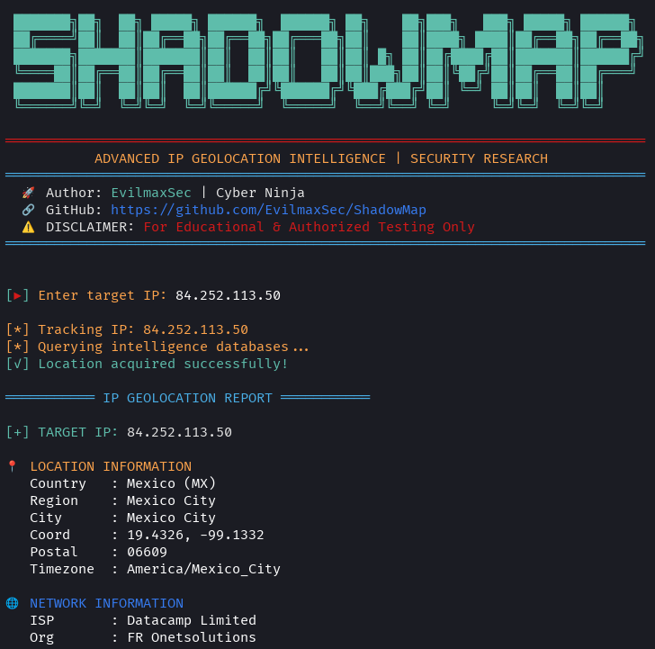
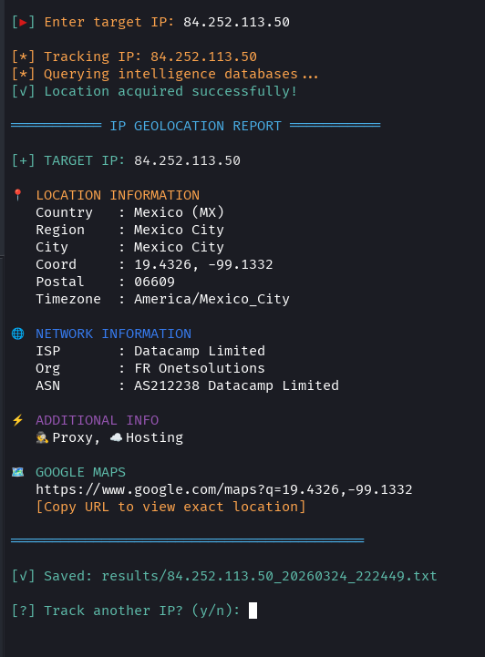

# 🗺️ ShadowMap - IP Geolocation Intelligence Tool


**Created by [EvilmaxSec](https://github.com/EvilmaxSec)** • ⚡ purple Team Ready
📍 A professional IP geolocation tool that tracks IP addresses with multi-source accuracy and Google Maps integration.

> ⚠️ For **educational** and **authorized testing** only.

---

## 🔥 Features

- ✅ **Multi-Source Accuracy** - Queries 3 different APIs (ip-api, ipapi.co, ipwho.is)
- 🗺️ **Google Maps Integration** - Direct clickable URL to exact location
- 🌐 **Network Intelligence** - ISP, Organization, ASN, Hosting detection
- 📍 **Precision Coordinates** - Latitude/Longitude with accuracy estimation
- 🔍 **Proxy/VPN Detection** - Identifies if IP is behind proxy or VPN
- 📱 **Mobile Optimized** - Works perfectly on Termux (Android)
- 💾 **Auto-Save Reports** - Saves detailed reports to `results/` folder
- 🎨 **Matrix-Style UI** - Clean, professional hacker aesthetic

---

## 🚀 Installation

### Linux

Clone the repo and install the dependencies:
```bash
git clone https://github.com/EvilmaxSec/ShadowMap.git
cd ShadowMap
pip install -r requirements.txt
chmod +x shadowmap.py
./shadowmap.py 
```
### **📱 Termux (Android) Installation**
update and upgrade
```bash
pkg update && pkg upgrade -y
pkg install python git -y
git clone https://github.com/EvilmaxSec/ShadowMap.git
cd ShadowMap
pip install -r requirements.txt
python shadowmap.py
```
## 🧠 Usage

Run the script using Python 3:
```bash
python3 shadowmap.py
```

## screenshot



## License

This project is licensed under the MIT License. See the ****

## ⚠️ Disclaimer

This tool is provided for educational purposes only. Use it only in environments you own or have explicit permission to test.

---

⚔️ **Stay stealthy. Stay precise. Track like a ghost. Hunt like a predator.**

🗺️ *Every IP tells a story. ShadowMap helps you read it.*
